# AWS EKS CI/CD & GitOps

This project demonstrates the design and implementation of a complete cloud-native application delivery platform on **Amazon Web Services (AWS)**.

A Python Flask `Hello, World!` application is containerized with Docker, stored in Amazon Elastic Container Registry (ECR), and deployed to an Amazon Elastic Kubernetes Service (EKS) cluster using Helm.

The project implements **two CI/CD approaches**:

- **Main branch:** Jenkins CI/CD
- **GitOps branch:** GitHub Actions + Argo CD

The infrastructure is provisioned with **Terraform**, application pods are automatically scaled using the **Kubernetes Horizontal Pod Autoscaler (HPA)**, worker-node capacity is managed by the **Kubernetes Cluster Autoscaler**, and the application is exposed publicly through an **AWS Application Load Balancer (ALB)**.

---

## Architecture

The solution combines Infrastructure as Code, containerization, Kubernetes orchestration, autoscaling, CI/CD, GitOps, and AWS identity management.

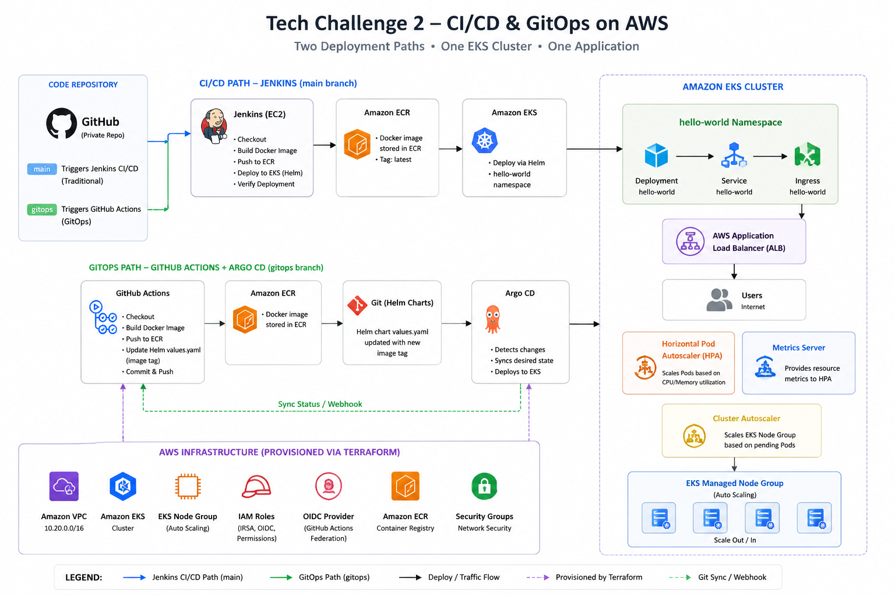

### Architecture Components

| Component | Purpose |
|---|---|
| GitHub | Private source-code repository and GitOps desired state |
| Docker | Packages the Flask application as a container |
| Amazon ECR | Stores application container images |
| Terraform | Provisions the AWS infrastructure |
| Amazon EKS | Managed Kubernetes control plane |
| EKS Managed Node Group | Provides Kubernetes worker-node compute capacity |
| Helm | Packages and deploys Kubernetes application resources |
| Metrics Server | Supplies CPU and memory metrics |
| HPA | Automatically scales application pods |
| Cluster Autoscaler | Adjusts EKS worker-node capacity |
| AWS Load Balancer Controller | Creates and manages the ALB from Kubernetes Ingress |
| Jenkins | Main-branch CI/CD automation |
| GitHub Actions | GitOps-branch CI automation |
| AWS OIDC | Passwordless GitHub Actions authentication to AWS |
| Argo CD | GitOps continuous delivery and cluster reconciliation |
| AWS ALB | Public entry point for the application |

---

## Technology Stack

| Category | Technology |
|---|---|
| Application | Python / Flask |
| Production Web Server | Gunicorn |
| Containerization | Docker |
| Container Registry | Amazon ECR |
| Infrastructure as Code | Terraform |
| Cloud Platform | AWS |
| Kubernetes | Amazon EKS |
| Kubernetes Packaging | Helm |
| Pod Autoscaling | Horizontal Pod Autoscaler |
| Node Autoscaling | Cluster Autoscaler |
| Metrics | Kubernetes Metrics Server |
| Load Balancing | AWS Application Load Balancer |
| Main CI/CD | Jenkins |
| GitOps CI | GitHub Actions |
| GitOps CD | Argo CD |
| Authentication | AWS IAM / OIDC / IRSA |
| Source Control | GitHub |

---

## Repository Structure

```text
tech-challenge-2/
│
├── app/
│   ├── app.py
│   ├── requirements.txt
│   ├── Dockerfile
│   └── .dockerignore
│
├── terraform/
│   ├── .terraform.lock.hcl
│   ├── aws-load-balancer-controller-iam-policy.json
│   ├── ecr.tf
│   ├── eks.tf
│   ├── iam.tf
│   ├── outputs.tf
│   ├── providers.tf
│   ├── variables.tf
│   └── vpc.tf
│
├── helm/
│   └── hello-world/
│       ├── Chart.yaml
│       ├── values.yaml
│       └── templates/
│
├── argocd/                         # GitOps branch
│   └── application.yaml
│
├── .github/                        # GitOps branch
│   └── workflows/
│       └── gitops.yml
│
├── docs/
│   └── images/
│
├── Jenkinsfile
├── .gitignore
└── README.md
```

> **Note:** `.terraform/`, `terraform.tfstate`, `terraform.tfstate.backup`, and `tfplan` are local/generated Terraform artifacts and are intentionally excluded from version control. `.terraform.lock.hcl` is tracked so Terraform provider selections remain reproducible.

---

# Application

The application is intentionally simple because the primary focus of this challenge is infrastructure, Kubernetes, automation, CI/CD, and GitOps.

The Flask application responds to HTTP requests with:

```text
Hello, World!
```

The application is served with **Gunicorn** when running inside the Docker container.

---

## Running the Application Locally

Clone the repository:

```bash
git clone https://github.com/ClementAkanyah/tech-challenge-2.git
cd tech-challenge-2
```

Create a Python virtual environment:

```bash
python -m venv .venv
```

Activate the environment and install the application dependencies:

```bash
pip install -r app/requirements.txt
```

Run the Flask application:

```bash
python app/app.py
```

The application can then be accessed locally at:

```text
http://localhost:5000
```

Expected response:

```text
Hello, World!
```

---

# Containerization with Docker

The Flask application is packaged as a Docker image so that the same application artifact can run locally, in Jenkins, and inside Amazon EKS.

Build the image:

```bash
docker build -t tech-challenge-2-app:1.0 ./app
```

Run the container locally:

```bash
docker run -p 5000:5000 tech-challenge-2-app:1.0
```

The container exposes the application through Gunicorn on port `5000`.

---

# Infrastructure as Code with Terraform

Terraform is used to provision the AWS infrastructure required by the application.

The Terraform configuration is separated by responsibility:

| File | Purpose |
|---|---|
| `providers.tf` | Terraform and AWS provider configuration |
| `variables.tf` | Reusable input variables |
| `vpc.tf` | VPC, subnets, routing, and networking |
| `ecr.tf` | Amazon ECR repository |
| `eks.tf` | EKS cluster and managed node group |
| `iam.tf` | IAM roles and Kubernetes AWS integrations |
| `outputs.tf` | Infrastructure outputs |
| `aws-load-balancer-controller-iam-policy.json` | IAM permissions used by the AWS Load Balancer Controller |

Initialize Terraform:

```bash
cd terraform
terraform init
```

Format and validate:

```bash
terraform fmt
terraform validate
```

Create an execution plan:

```bash
terraform plan
```

### Terraform Plan

The Terraform plan was reviewed before infrastructure creation.

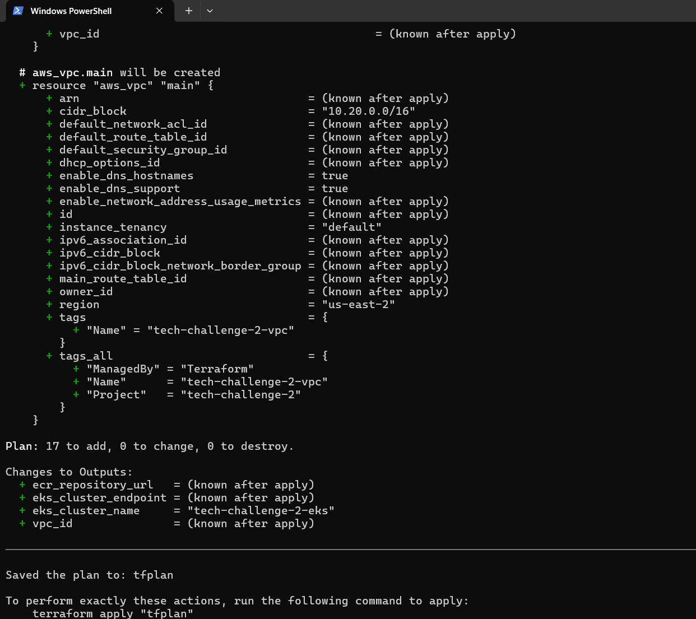

Apply the infrastructure:

```bash
terraform apply
```

### Terraform Apply

Terraform successfully created the AWS infrastructure required for the EKS environment.

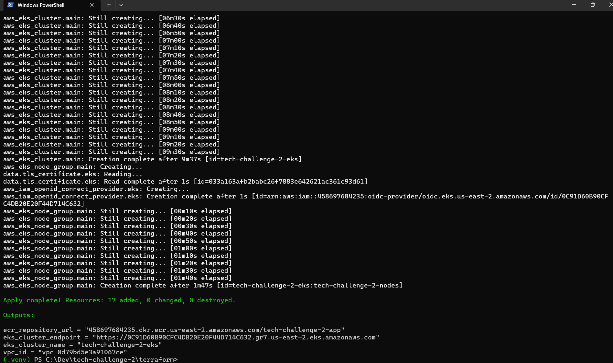

---

# Amazon ECR

Amazon Elastic Container Registry stores the Docker images used by the Kubernetes Deployment.

The repository used by this project is:

```text
tech-challenge-2-app
```

After authenticating Docker to ECR, the application image is tagged and pushed to the registry.

Example:

```bash
docker tag tech-challenge-2-app:1.0 \
<AWS_ACCOUNT_ID>.dkr.ecr.us-east-2.amazonaws.com/tech-challenge-2-app:1.0
```

Push:

```bash
docker push \
<AWS_ACCOUNT_ID>.dkr.ecr.us-east-2.amazonaws.com/tech-challenge-2-app:1.0
```

### ECR Image Push

The image layers were successfully uploaded and the image digest was returned by ECR.

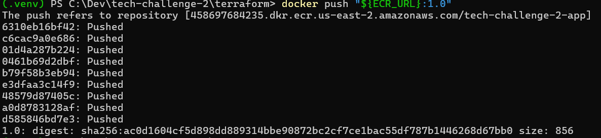

---

# Amazon EKS

The Kubernetes cluster is deployed using Amazon Elastic Kubernetes Service.

Cluster name:

```text
tech-challenge-2-eks
```

AWS region:

```text
us-east-2
```

Configure local `kubectl` access:

```bash
aws eks update-kubeconfig \
  --region us-east-2 \
  --name tech-challenge-2-eks
```

Verify the worker nodes:

```bash
kubectl get nodes
```

### EKS Worker Node

The managed EKS worker node successfully joined the cluster and reached the `Ready` state.

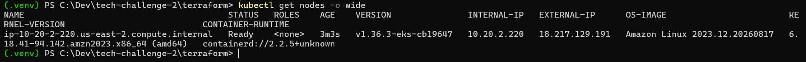

---

# Kubernetes Deployment with Helm

The application is packaged as a Helm chart.

The chart manages the main Kubernetes application resources:

- Deployment
- ClusterIP Service
- Ingress
- HorizontalPodAutoscaler
- Container resource requests and limits
- Readiness checks
- Liveness checks
- Pod distribution configuration

Deploy the application:

```bash
helm upgrade --install hello-world ./helm/hello-world \
  --namespace hello-world \
  --create-namespace
```

Verify:

```bash
kubectl get pods -n hello-world
kubectl get service -n hello-world
kubectl get ingress -n hello-world
kubectl get hpa -n hello-world
```

### Kubernetes Workload and HPA

The application Deployment and Horizontal Pod Autoscaler are running in the `hello-world` namespace.

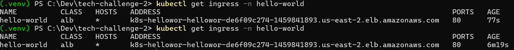

---

# Kubernetes Autoscaling

The project implements autoscaling at **two levels**.

## Horizontal Pod Autoscaler

The HPA automatically changes the number of application replicas based on resource utilization.

Configuration:

```text
Minimum application replicas: 1
Maximum application replicas: 3
CPU utilization target:       50%
Memory utilization target:    50%
```

Metrics Server provides the CPU and memory measurements required by the HPA.

The HPA can be inspected with:

```bash
kubectl get hpa -n hello-world
kubectl describe hpa hello-world -n hello-world
```

## Cluster Autoscaler

The Kubernetes Cluster Autoscaler adjusts EKS worker-node capacity when workloads cannot be scheduled with the existing cluster resources.

The EKS managed node group is configured with:

```text
Instance type:  t3.small
Minimum nodes:  1
Desired nodes:  1
Maximum nodes:  4
```

### Cluster Autoscaler Verification

The Cluster Autoscaler pod is running in the `kube-system` namespace.

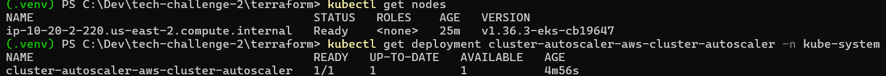

Together, HPA and Cluster Autoscaler provide two layers of elasticity:

```text
Application demand increases
        ↓
HPA creates additional pods
        ↓
Existing nodes reach scheduling capacity
        ↓
Cluster Autoscaler increases worker-node capacity
```

---

# AWS Load Balancer Controller

The AWS Load Balancer Controller runs inside EKS and monitors Kubernetes Ingress resources.

When the application Ingress is created, the controller provisions and configures an AWS Application Load Balancer.

The controller uses AWS IAM permissions through the Kubernetes service account integration rather than hard-coded AWS credentials.

### Controller Verification

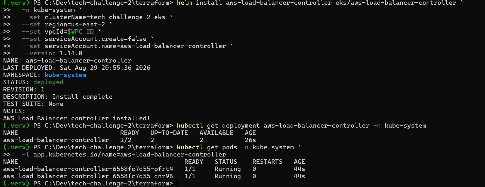

---

# Application Load Balancer and Kubernetes Ingress

The application is exposed using a Kubernetes Ingress with the AWS ALB ingress class.

Verify:

```bash
kubectl get ingress -n hello-world
```

The resulting Ingress contains the AWS-generated ALB hostname.

### ALB Ingress

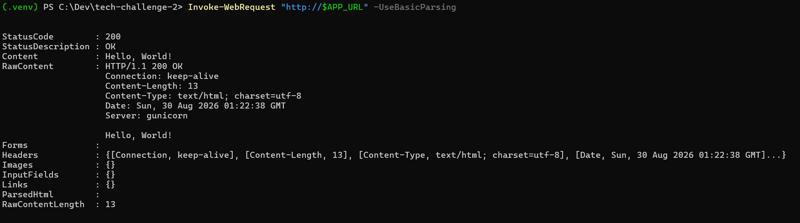

---

# Public Application Verification

The ALB routes internet traffic to the Kubernetes application.

The application can be tested from PowerShell:

```powershell
Invoke-WebRequest `
  "http://k8s-hellowor-hellowor-de6f09c274-1459841893.us-east-2.elb.amazonaws.com" `
  -UseBasicParsing
```

The endpoint returned:

```text
StatusCode : 200
Content    : Hello, World!
```

### HTTP Verification

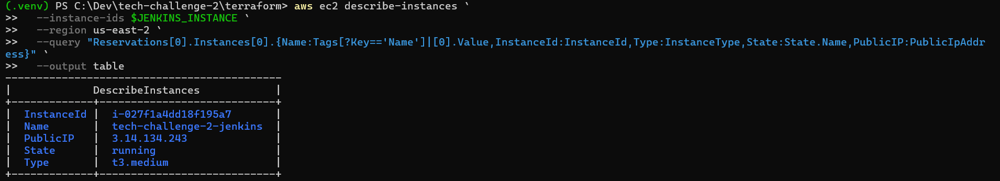

The same application was also verified through a web browser.

### Browser Verification

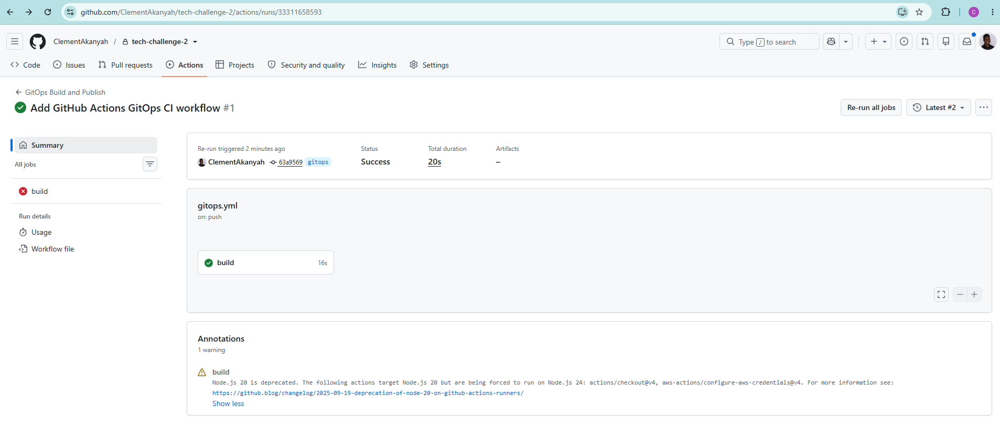

---

# CI/CD Implementation 1 — Jenkins

The primary CI/CD implementation is maintained on the **`main` branch**.

Jenkins runs on a dedicated Amazon EC2 instance and automates the complete application delivery process.

The Jenkins pipeline performs:

```text
GitHub
   ↓
Checkout source code
   ↓
Build Docker image
   ↓
Authenticate to Amazon ECR
   ↓
Tag and push image
   ↓
Configure kubectl
   ↓
Deploy with Helm
   ↓
Wait for Kubernetes rollout
   ↓
Verify Deployment / Service / Ingress / HPA
```

---

## Jenkins Server

Jenkins is hosted on an EC2 instance.

The instance was configured with the tools required by the pipeline, including:

- Git
- Docker
- AWS CLI
- kubectl
- Helm
- Java
- Jenkins

### Jenkins EC2 Instance

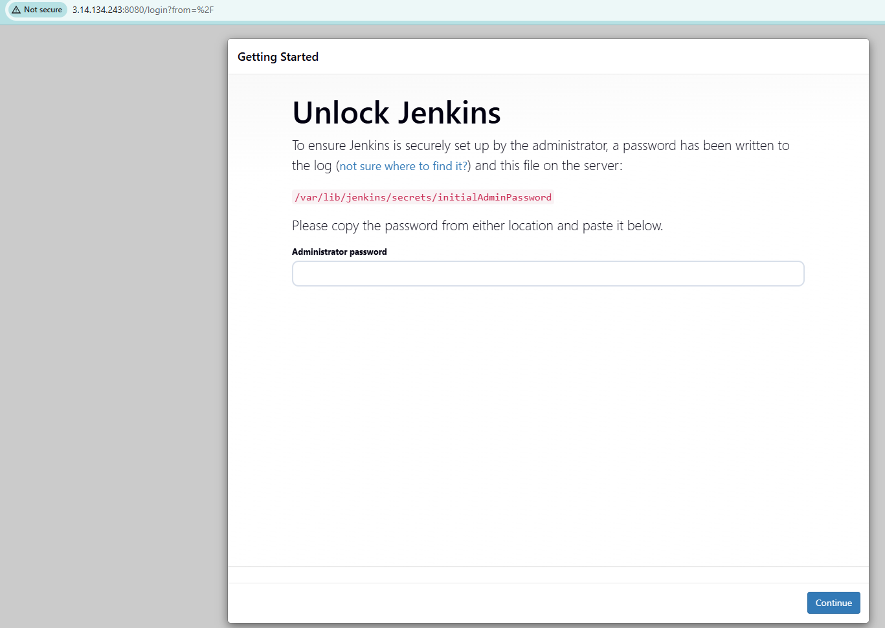

---

## Jenkins AWS Authentication

The Jenkins EC2 instance uses an **IAM instance role** for AWS access.

This avoids placing long-lived AWS access keys inside:

- Jenkins credentials
- the `Jenkinsfile`
- the Git repository

The Jenkins IAM role was also granted the required EKS access so that the pipeline could deploy Kubernetes workloads.

---

## Jenkins Private GitHub Access

Because the repository is private, Jenkins uses a dedicated SSH deploy key to access GitHub.

GitHub's SSH host key was added to the Jenkins user's `known_hosts` file to provide host verification.

This resolved the initial:

```text
Host key verification failed
```

and:

```text
Permission denied (publickey)
```

errors encountered during repository configuration.

---

## Jenkins Dashboard

After configuration, the Jenkins pipeline was available from the Jenkins dashboard.

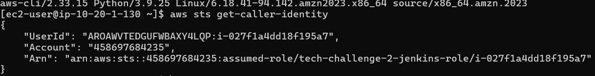

---

## Jenkins Pipeline as Code

The CI/CD pipeline is defined in the repository's:

```text
Jenkinsfile
```

This keeps the build and deployment process version controlled with the application.

The pipeline automates:

1. Source checkout
2. Docker image build
3. ECR authentication
4. Docker image tagging
5. Image push to ECR
6. EKS kubeconfig configuration
7. Helm deployment
8. Kubernetes rollout verification
9. Deployment status checks

---

## Jenkins Pipeline Success

The Jenkins pipeline completed successfully.

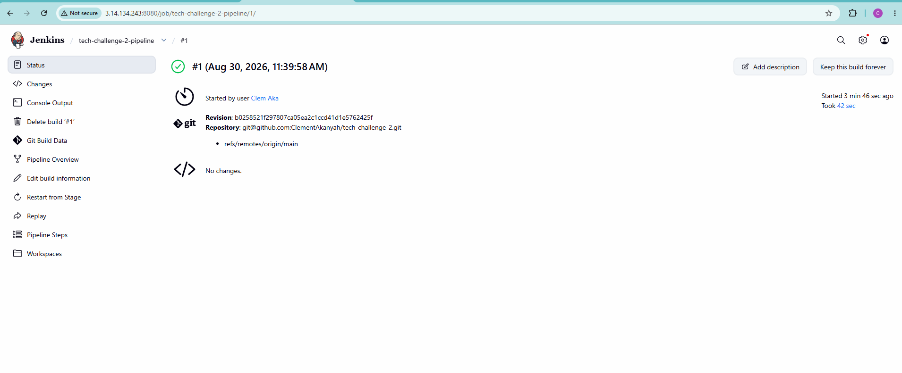

---

## Jenkins Deployment Verification

The pipeline verified the Kubernetes workload after deployment.

The verification confirmed:

- Application pod running
- Kubernetes Service available
- ALB Ingress available
- HPA configured
- Deployment rollout successful

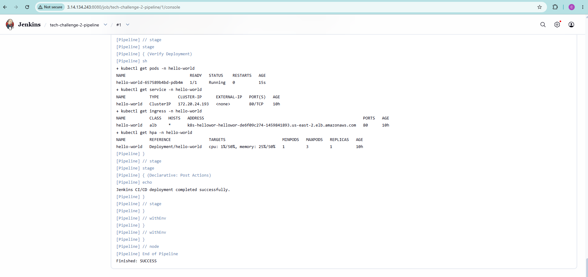

---

# CI/CD Implementation 2 — GitHub Actions + Argo CD

A second delivery implementation is maintained on the **`gitops` branch**.

This approach separates CI from deployment:

```text
GitHub Actions = Build and publish
Argo CD        = Deploy and reconcile
```

The GitOps flow is:

```text
Developer pushes to gitops
        ↓
GitHub Actions
        ↓
AWS authentication with OIDC
        ↓
Docker image build
        ↓
Push commit-tagged image to ECR
        ↓
Update Helm image tag in Git
        ↓
Commit desired-state change
        ↓
Argo CD detects Git change
        ↓
Argo CD synchronizes EKS
        ↓
New application version deployed
```

---

## GitHub Actions

The workflow is stored on the `gitops` branch at:

```text
.github/workflows/gitops.yml
```

GitHub Actions performs:

1. Repository checkout
2. AWS authentication
3. ECR authentication
4. Docker image build
5. Docker image push
6. Helm image-tag update
7. Commit of the new desired state

### GitHub Actions Success

The GitOps workflow completed successfully.

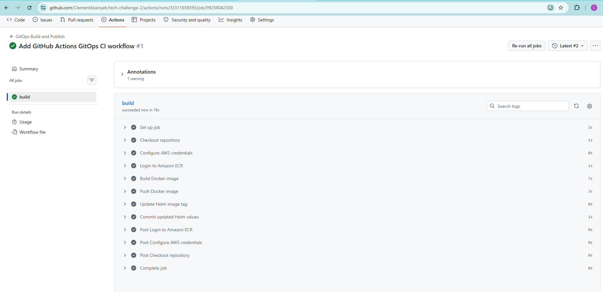

---

## Passwordless AWS Authentication with OIDC

GitHub Actions authenticates to AWS using OpenID Connect rather than stored AWS access keys.

The AWS IAM OIDC provider trusts:

```text
token.actions.githubusercontent.com
```

GitHub Actions assumes the dedicated AWS IAM role at runtime.

This provides short-lived AWS credentials and eliminates the need to store permanent AWS access keys in GitHub Secrets.

---

# Argo CD

Argo CD provides the continuous-delivery portion of the GitOps implementation.

Argo CD runs inside the EKS cluster and monitors:

```text
Branch: gitops
Path:   helm/hello-world
```

The Argo CD Application is defined at:

```text
argocd/application.yaml
```

Automated synchronization is configured so that Git is treated as the desired state of the cluster.

The configuration includes:

```yaml
syncPolicy:
  automated:
    prune: true
    selfHeal: true
```

This allows Argo CD to:

- Automatically deploy Git changes
- Remove resources deleted from Git
- Correct configuration drift in the Kubernetes cluster

---

## Argo CD Synchronization

The Argo CD application reached:

```text
Sync Status:   Synced
Health Status: Healthy
```

### Argo CD Synced and Healthy

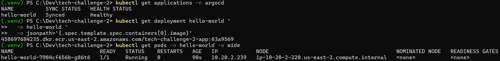

---

## GitOps Deployment Verification

GitHub Actions tags application images using the Git commit identifier.

After Argo CD synchronized the Helm change, the running Kubernetes Deployment was inspected to confirm that EKS was using the new commit-tagged image.

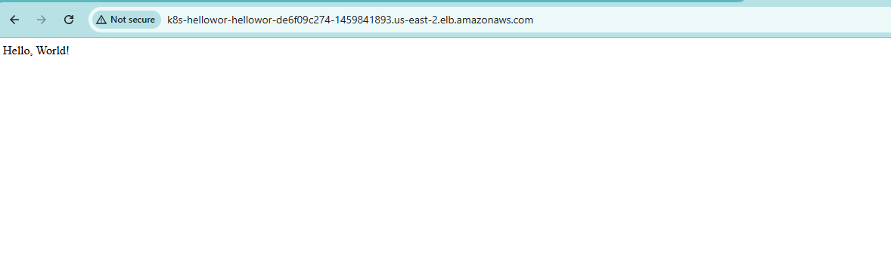

This verifies the complete GitOps chain:

```text
Git commit
   ↓
GitHub Actions
   ↓
Amazon ECR
   ↓
Git desired state
   ↓
Argo CD
   ↓
Amazon EKS
```

---

# Why Two CI/CD Implementations?

The project intentionally demonstrates two deployment strategies.

| Main Branch | GitOps Branch |
|---|---|
| Jenkins | GitHub Actions |
| Pipeline performs deployment | CI updates Git desired state |
| Helm executed by Jenkins | Helm state reconciled by Argo CD |
| EC2 IAM role | GitHub OIDC IAM role |
| Traditional CI/CD | GitOps CI/CD |

The **main branch** satisfies the Jenkins-based deployment requirement.

The **gitops branch** demonstrates a modern GitOps alternative where the CI system does not directly deploy into Kubernetes. Instead, Git becomes the source of truth and Argo CD reconciles the cluster.

---

# Security Considerations

Several security practices were implemented throughout the project.

## AWS Credentials

Permanent AWS access keys are not stored in the repository.

Jenkins uses:

```text
EC2 IAM Instance Role
```

GitHub Actions uses:

```text
GitHub OIDC → AWS IAM Role
```

## GitHub Repository Access

Dedicated repository access was configured for:

- Jenkins
- Argo CD

Private SSH keys are not committed to Git.

## Terraform

The following local/generated Terraform artifacts are excluded from version control:

```text
.terraform/
terraform.tfstate
terraform.tfstate.backup
tfplan
```

The Terraform dependency lock file remains tracked:

```text
.terraform.lock.hcl
```

## Repository Audit

Before final submission, the repository was checked for:

- AWS access keys
- AWS secret keys
- GitHub personal access tokens
- PEM private keys
- SSH private keys
- Terraform state
- `.env` credential files

No committed credentials were found.

---

# Troubleshooting

Several real deployment issues were encountered and resolved during the implementation.

## Docker Desktop Engine Unavailable

Docker initially could not connect to the local Docker Desktop Linux engine.

**Resolution:** Docker Desktop was started and the image build was rerun.

---

## Amazon ECR Authentication

The initial PowerShell pipeline into `docker login` returned:

```text
400 Bad Request
```

The ECR password was retrieved first and then supplied to Docker authentication successfully.

---

## Jenkins Could Not Reach EKS

The initial Jenkins `kubectl` request returned an EKS API timeout.

**Resolution:** Network access between the Jenkins EC2 security group and the EKS cluster API was corrected.

---

## Jenkins Kubernetes Authorization

After network connectivity was fixed, Jenkins reached EKS but received:

```text
nodes is forbidden
```

**Resolution:** EKS access was configured for the Jenkins IAM role.

After the change:

```bash
kubectl get nodes
```

successfully returned the EKS worker node.

---

## Jenkins GitHub SSH Verification

Jenkins initially returned:

```text
Host key verification failed
```

GitHub's SSH host key was added to the Jenkins user's `known_hosts`.

The subsequent:

```text
Permission denied (publickey)
```

error was resolved by configuring the dedicated GitHub deploy key.

---

## ALB Browser Timeout

The application initially appeared to time out in Chrome.

PowerShell verification showed:

```text
StatusCode        : 200
Content           : Hello, World!
TcpTestSucceeded  : True
```

This confirmed that the ALB, network path, Kubernetes Service, and application were operating correctly.

---

## GitHub Actions OIDC Authorization

The first GitHub Actions OIDC attempt failed with:

```text
Not authorized to perform sts:AssumeRoleWithWebIdentity
```

The IAM trust policy was corrected to match the GitHub repository OIDC subject.

The workflow was rerun successfully.

---

## GitOps Branch Push Conflict

GitHub Actions committed an updated image tag back to the remote `gitops` branch while a local documentation commit also existed.

The histories were safely reconciled using:

```bash
git pull --rebase origin gitops
```

This preserved both the automated GitOps image update and the documentation commit without force-pushing.

---

# Deployment Verification

The completed environment was verified at multiple layers.

## Kubernetes

```bash
kubectl get nodes
kubectl get pods -n hello-world
kubectl get hpa -n hello-world
kubectl get ingress -n hello-world
```

## Jenkins

The Jenkins pipeline completed with:

```text
Finished: SUCCESS
```

## GitHub Actions

The GitOps workflow completed successfully.

## Argo CD

The application reported:

```text
Synced
Healthy
```

## Public Application

The final ALB endpoint returned:

```text
HTTP 200 OK
Hello, World!
```

---

# Branch Strategy

## `main`

Primary challenge implementation:

```text
GitHub
   ↓
Jenkins
   ↓
Docker
   ↓
Amazon ECR
   ↓
Helm
   ↓
Amazon EKS
   ↓
AWS ALB
```

## `gitops`

GitOps alternative:

```text
GitHub
   ↓
GitHub Actions
   ↓
Amazon ECR
   ↓
Git desired state
   ↓
Argo CD
   ↓
Amazon EKS
   ↓
AWS ALB
```

The branches were intentionally kept separate so that the two CI/CD approaches can be reviewed independently.

---

# Cleanup and Cost Control

## Cleanup and Cost Control

After completing deployment and verification, I destroyed the AWS resources to prevent ongoing charges. The Terraform, Kubernetes, Helm, and pipeline configurations remain available for review and reproduction.

After reviewing, Terraform-managed infrastructure can be removed with:

```bash
cd terraform
terraform destroy
```

Any resources created outside Terraform should also be removed manually after they are no longer required.

---

# Key Outcomes

This project demonstrates:

- Docker application containerization
- Amazon ECR image management
- Infrastructure as Code with Terraform
- Amazon EKS provisioning
- Kubernetes deployments with Helm
- Kubernetes Metrics Server
- Horizontal Pod Autoscaling
- EKS worker-node autoscaling
- AWS Application Load Balancer integration
- Jenkins CI/CD
- EC2 IAM role authentication
- GitHub Actions CI
- AWS OIDC federation
- Argo CD continuous delivery
- Automated GitOps synchronization
- Private GitHub repository integration
- Public application deployment

---

# Deployment Result

The completed application is publicly accessible through the AWS Application Load Balancer.

**Live Application**

```text
http://k8s-hellowor-hellowor-de6f09c274-1459841893.us-east-2.elb.amazonaws.com
```

Expected response:

```text
Hello, World!
```

---

# Repository

**GitHub Repository**

```text
https://github.com/ClementAkanyah/tech-challenge-2
```

Branch implementations:

```text
main   → Jenkins CI/CD implementation
gitops → GitHub Actions + Argo CD implementation
```

---

# Author

**Clement Akanyah**

DevOps Technical Challenge — AWS EKS CI/CD & GitOps
